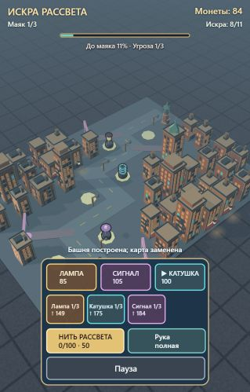

# Искра рассвета

**Изометрическая браузерная tower defense о караване, который возвращает свет мистическому городу.**

Игрок сопровождает Искру рассвета через три района Нью-Йорка: выбирает колоду башен, строит защиту вдоль маршрута и выдерживает последнюю волну у маяка. Победы открывают новые башни, постоянные модификации и сюжетные улики.

**Движок:** [ArcEngine](https://github.com/xaidan777/ArcEngine) / Babylon.js · **Платформа:** браузер · **Этап:** играбельный прототип

<p align="center">
  
</p>

*Скриншот текущего прототипа. Игровые модели и баланс находятся в разработке.*

## Мой вклад

Это личный проект, которым я занимаюсь в свободное время. Мой вклад — **идея игры, игровые механики и сюжет**. Прототип на готовом ArcEngine позволяет проверить задуманный игровой цикл в браузере.

Подробнее о правилах, ролях башен и развитии истории — в [дизайн-документе](https://github.com/DXaten/NYC_TowerDefense/blob/main/docs/GAME_DESIGN.md).

## Игровой цикл

1. Выбрать район и колоду доступных башен.
2. Расставить стартовую защиту и отправить караван.
3. Строить и улучшать башни по пути, используя монеты и карты из руки.
4. Зажигать фонари и накапливать заряд **Нити рассвета** для очищающего импульса.
5. Довести караван до маяка и выдержать последнюю волну.
6. Получить улику и модификацию, открыть новые возможности для следующего района.

## Что уже работает

| Система | Реализация в прототипе |
| --- | --- |
| Районы | Три карты с отдельными маршрутами и нарастающей угрозой |
| Башни | Пять типов: Лампа, Катушка, Сигнал, Прожектор и Реле |
| Противники | Четыре типа с разными игровыми ролями и сопротивлениями |
| Карты | Выбор колоды, случайная рука из трёх карт и платное обновление руки |
| Улучшения | Повышение ранга всего типа башен, включая будущие постройки |
| Нить рассвета | Фонари усиливают защиту и дают заряд для импульса по освещённой части пути |
| Прогресс | Открытие районов и башен, модификации, улики и локальное сохранение |
| Управление | Касания на телефоне, мышь на ПК и пауза |

## Башни и их роли

| Башня | Задача |
| --- | --- |
| Лампа | Сильная одиночная атака против бронированного противника |
| Катушка | Цепная атака против плотных групп |
| Сигнал | Замедление и раскрытие скрытых духов |
| Прожектор | Дальняя точная атака против быстрых противников |
| Реле | Усиление соседних башен |

## Локальный запуск

Нужны **Node.js** и браузер с поддержкой WebGL.

```bash
git clone https://github.com/DXaten/NYC_TowerDefense.git
cd NYC_TowerDefense
node tools/dev-server.mjs
```

Откройте адрес, который выведет сервер. На Windows можно использовать `run.bat`.

## Код и проверка механик

- [TDCore.js](https://github.com/DXaten/NYC_TowerDefense/blob/main/js/TDCore.js) — игровая логика, отделённая от 3D-рендера.
- [TDLevels.js](https://github.com/DXaten/NYC_TowerDefense/blob/main/js/TDLevels.js) — маршруты, площадки и настройки районов.
- [Game.js](https://github.com/DXaten/NYC_TowerDefense/blob/main/js/Game.js) — сцена, интерфейс и игровой прогресс.
- [Тесты игрового цикла](https://github.com/DXaten/NYC_TowerDefense/blob/main/tests/td-core.test.mjs) — роли башен, колода, улучшения, волны и Нить рассвета.

Проверить только игровую логику:

```bash
node --test tests/td-core.test.mjs
```

Полная проверка проекта и сборка архива:

```bash
node tools/check.mjs
node tools/build.mjs
```

Архив для загрузки на площадку появится в `dist/`.

## Следующий этап

- Подготовить финальные игровые 3D-модели.
- Проверить читаемость интерфейса, баланс и производительность на телефонах.
- Проверить интеграцию SDK непосредственно в консоли Яндекс Игр.
- Подготовить версию для публикации; рекламу добавить после проверки игрового цикла.

## Основа проекта и визуальные материалы

Проект использует готовый [ArcEngine](https://github.com/xaidan777/ArcEngine) на Babylon.js. Исходная лицензия движка MIT (© 2026 Tearevo) сохранена в [LICENSE](https://github.com/DXaten/NYC_TowerDefense/blob/main/LICENSE).

Референсы персонажей и состояние подготовки моделей описаны в [references/tripo/README.md](https://github.com/DXaten/NYC_TowerDefense/blob/main/references/tripo/README.md). Финальные игровые модели находятся в разработке.
